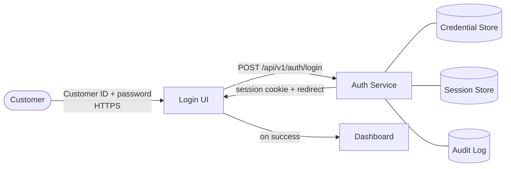
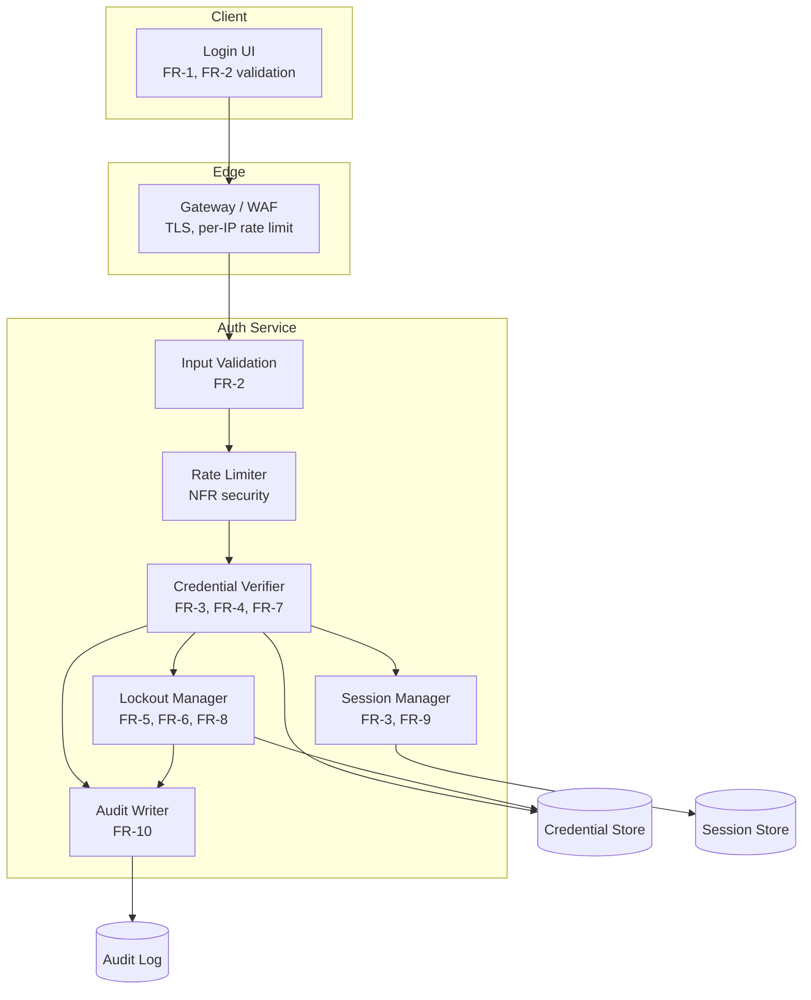
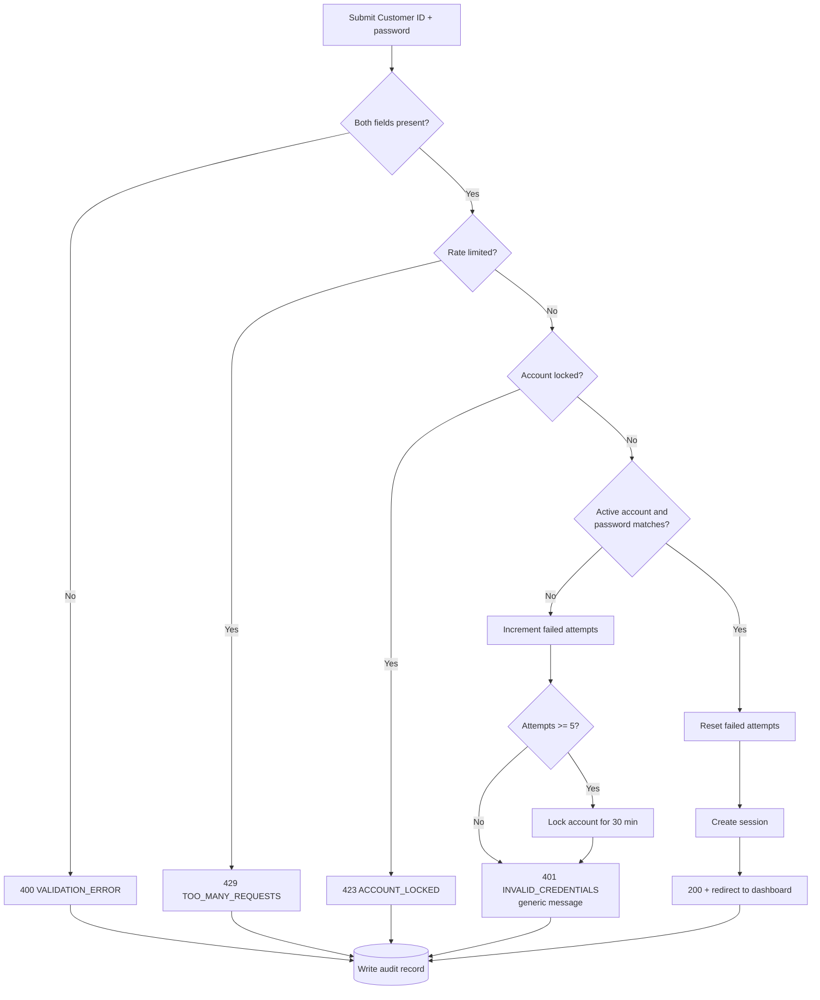
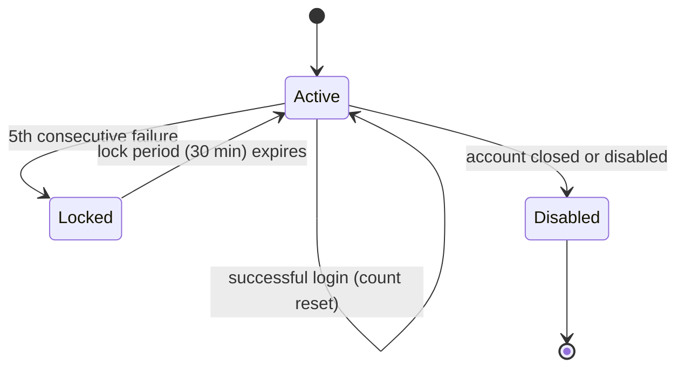
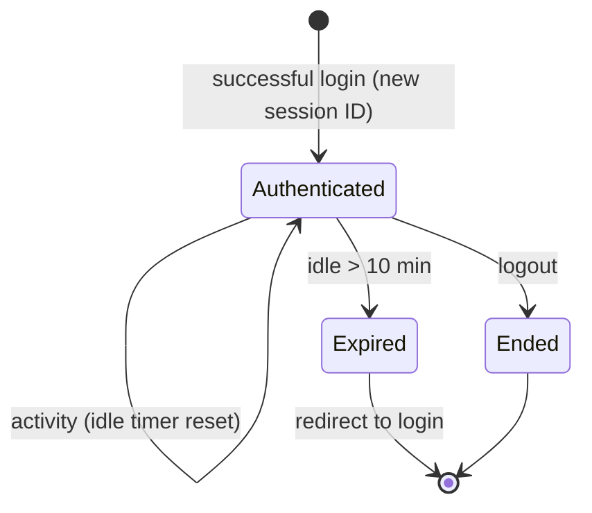

# Architecture: Customer Login

Derived from [customer-login.md](./customer-login.md). Implementation detail lives in [customer-login-design.md](./customer-login-design.md). Technology choices are not yet made, so components are logical.

## 1. System Context

## 2. Components and Requirements

## 3. Login Flow

## 4. Account Lockout States

Thresholds (5 attempts, 30 min) are placeholders from the spec.

## 5. Session Lifecycle

