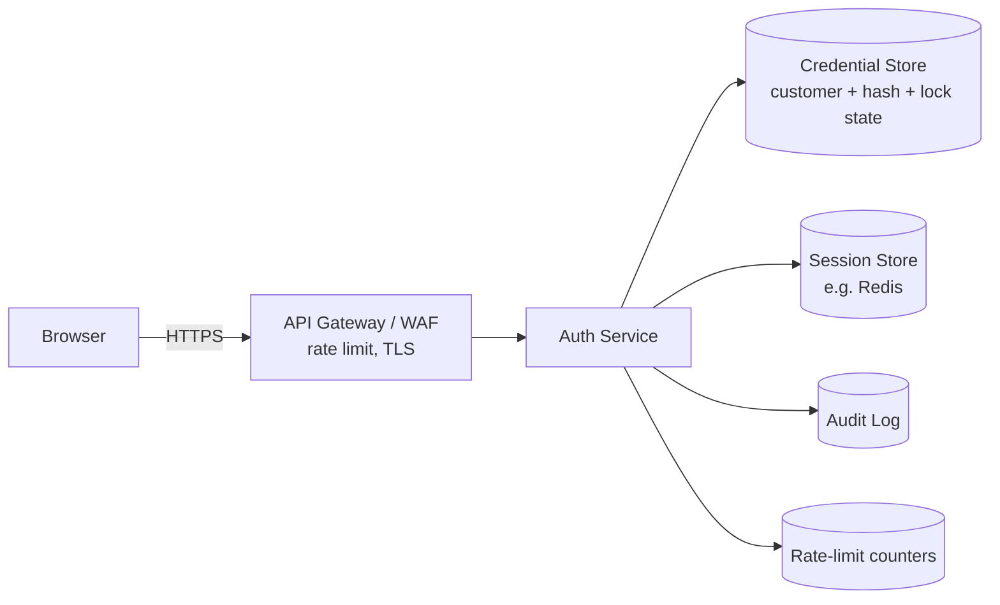

# Design: Customer Login (Customer ID + Password)

- **Status:** Draft
- **Implements:** [customer-login.md](./customer-login.md)
- **Note:** The tech stack is not yet chosen (spec open question 7). This design is stack-agnostic; concrete technology choices are marked **[TBD]**.

## 1. Overview

A server-side authentication service verifies a Customer ID and password, enforces lockout and rate limits, and issues a server-tracked session delivered via a secure cookie. A web client renders the login form and calls a single login endpoint.

## 2. Architecture



| Component | Responsibility |
|-----------|----------------|
| Login UI | Form, client-side validation, error display, redirect on success |
| API Gateway / WAF | TLS termination, coarse per-IP rate limiting, request size limits |
| Auth Service | Validate input, verify credentials, lockout logic, session issuance, audit events |
| Credential Store | Customer ID, password hash, status, failed-attempt count, lock-until |
| Session Store | Session ID -> customer, created/last-seen timestamps, TTL |
| Audit Log | Append-only record of login outcomes |

## 3. Login Flow

```mermaid
sequenceDiagram
    participant B as Browser
    participant A as Auth Service
    participant C as Credential Store
    participant S as Session Store
    participant L as Audit Log
    B->>A: POST /api/v1/auth/login {customerId, password} (+CSRF token)
    A->>A: Validate fields, check rate limit
    A->>C: Load customer by customerId
    alt locked (lock_until > now)
        A->>L: LOCKED
        A-->>B: 423 ACCOUNT_LOCKED
    else not found / disabled / hash mismatch
        A->>C: Increment failed count (if customer exists); lock if >= N
        A->>L: FAILURE
        A-->>B: 401 INVALID_CREDENTIALS
    else hash matches
        A->>C: Reset failed count
        A->>S: Create new session (rotate ID)
        A->>L: SUCCESS
        A-->>B: 200 + Set-Cookie (HttpOnly, Secure, SameSite)
    end
```

## 4. Data Model

**customer_credentials**
| Field | Type | Notes |
|-------|------|-------|
| customer_id | string, PK | Format TBD (spec Q2) |
| password_hash | string | Argon2id (preferred) or bcrypt; includes salt and params |
| status | enum | ACTIVE, DISABLED, CLOSED |
| failed_attempts | int | Reset on success |
| locked_until | timestamp, nullable | |
| updated_at | timestamp | |

**session** (TTL-based store)
| Field | Type | Notes |
|-------|------|-------|
| session_id | random 256-bit, opaque | Cookie value; store only a hash of it server-side |
| customer_id | string | |
| created_at / last_seen_at | timestamp | Sliding idle timeout |
| ip, user_agent | string | For audit/anomaly review |

**login_audit**
| Field | Type | Notes |
|-------|------|-------|
| id, timestamp | | |
| customer_id | string | As submitted |
| outcome | enum | SUCCESS, FAILURE, LOCKED, RATE_LIMITED |
| source_ip, user_agent | string | |
| (no password data, ever) | | |

## 5. Key Design Decisions

| Decision | Choice | Rationale |
|----------|--------|-----------|
| Session mechanism | Server-side opaque session ID in cookie | Immediate revocation (logout, lockout, admin kill); avoids long-lived bearer tokens in browser storage |
| Password hashing | Argon2id, tuned for ~250ms | Resistant to GPU cracking; bcrypt acceptable fallback |
| Error responses | One generic 401 for unknown ID, wrong password, disabled account | Prevents user enumeration (FR-4, FR-7) |
| Timing | Run a dummy hash verification when the customer does not exist | Equalises response time to limit enumeration |
| Lockout | Per-account counter in credential store, thresholds in config | Meets FR-5/FR-8; config avoids redeploy to tune |
| Rate limiting | Gateway per-IP plus service per-Customer ID | Lockout alone doesn't stop distributed guessing across many IDs |
| CSRF | Token required on login POST plus SameSite cookies | Prevents login CSRF |
| Session fixation | Always issue a new session ID on login | |

## 6. Security Considerations

- TLS only; HSTS enabled; cookies `Secure; HttpOnly; SameSite=Strict` (or Lax if required by flows).
- Never log request bodies on the login route; redact passwords in all telemetry.
- Parameterised queries only; strict input validation on Customer ID format and password max length (prevents hash-DoS).
- Lockout can be abused to deny service to a victim; mitigated by timed (not permanent) locks and per-IP limits. Revisit if MFA is added.
- Audit log is append-only with restricted write access; retention period per regulation (spec Q5).

## 7. Configuration

| Key | Default |
|-----|---------|
| `auth.maxFailedAttempts` | 5 |
| `auth.lockoutMinutes` | 30 |
| `auth.sessionIdleMinutes` | 10 |
| `auth.rateLimit.perIpPerMinute` | TBD |
| `auth.rateLimit.perCustomerPerMinute` | TBD |

Defaults are placeholders from the spec and need business/security sign-off.

## 8. Observability

- Metrics: login success/failure/lockout counts, latency p50/p95/p99, rate-limit hits.
- Alerts: spike in failures or lockouts (credential stuffing signal), elevated 5xx.
- Logs: structured, with correlation ID; no credentials.

## 9. Testing Strategy

Follows spec Section 8. Design-specific additions:
- Timing test: response time for unknown ID vs. wrong password is statistically indistinguishable.
- Session test: ID rotates on login; old/unknown IDs rejected; idle expiry honoured.
- Concurrency test: simultaneous failed attempts do not undercount toward the lockout threshold (use atomic increment).

## 10. Risks & Open Items

| Item | Impact | Owner |
|------|--------|-------|
| MFA requirement undecided | May add a second step to the flow and change session issuance | TBD |
| Tech stack/framework undecided | Blocks concrete implementation tasks | TBD |
| Regulatory scope (retention, SCA) | May change audit and auth-strength requirements | TBD |
| Legacy password hash format, if migrating existing customers | Needs rehash-on-login strategy | TBD |

## 11. Rollout

1. Build behind a feature flag in a non-production environment.
2. Security review and penetration test before any production exposure.
3. Gradual rollout with monitoring of the alerts above; rollback by disabling the flag.
